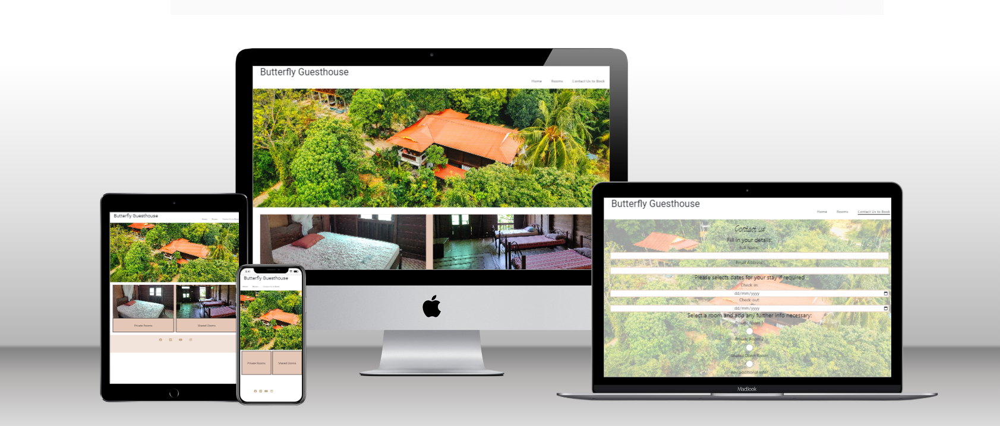
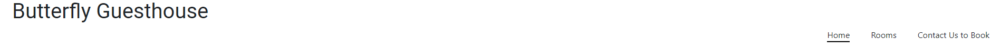
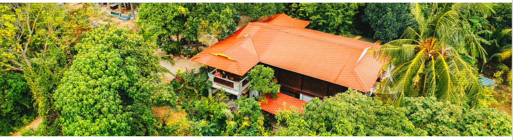
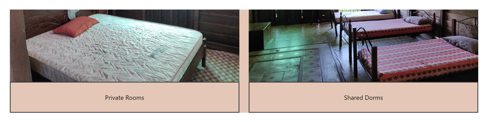
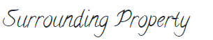
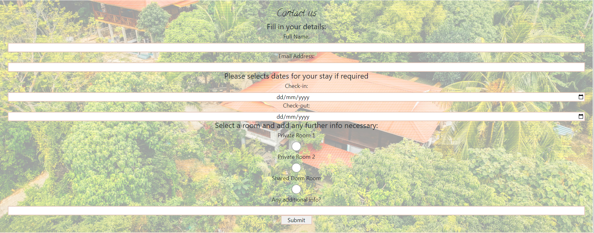
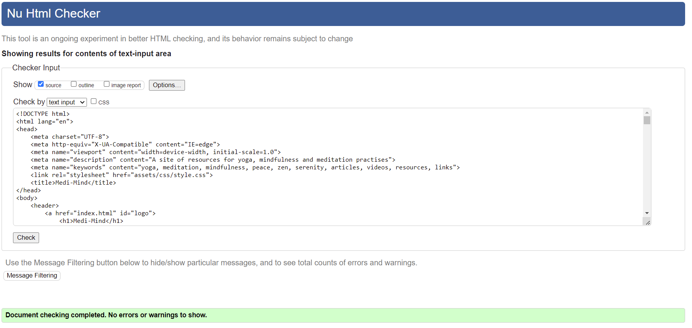
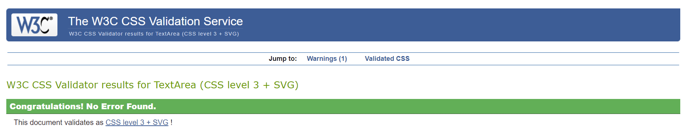

# Butterfly Guesthouse (BFGuesthouse)

Butterfly Guesthouse is a multi language website, demonstrating uses of HTML, Python and Javascript in a website built for The Butterfly Guesthouse on the island of Langkawi in Malaysia. It is in it's simplest form as a site where prospectice guests can view the property and contact the owners to make a booking.

View the live website [here](https://davidjf97.github.io/bfguesthouse/)

### Planning Stage

## User Experience (UX)
After discussions with the client, their goals for the website were established and boiled down to the most basic deployable first version to give what they want out of it and the user experience they want to give to potential guests also.
* User should:
    * Be able to see images of the property and surrounding area
    * Be made aware of rooming options available
    * Be able to contact the hosts through a basic form
* Client should:
    * Be able to view guests information put into the form
    * Be able to recall this information upon guest arrival to confirm bookings

## Features

### Header and Footer

* Navigation Bar
    * Located at the top of the page is a navigation bar. Each links to the corresponding section of the site's stand alone page.
    * This is useful to users as upon landing on the page they can see the content that is available and instantly navigate to their desired section of the site

* Social Media Links
    * Locate at the bottom of the page are the social media links, opening in new tabs.
    * This feature encourages further interactions as users can follow the site's social media pages and receive updates on their socisal media platform of choice

### Landing Page Content

* Hero Image
    * The Hero image features a birds-eye view of the guesthouse property.
    * This serves to greet the user with a calming image of the guesthouse, they get a full view of the surrounding area and the beauty of the property.

* Rooms Section 
    * Directly below the header is a section featuring the two rooming options on offer.
    * This serves as a straightforward display to guests. They can click through to view further images and then book the rooms of their choice as is standard on any accomodation booking site.

### Rooms/Photo Gallery

* Room Photos
    * Users can click through to images of respective room types from the home page or by use of the navigation bar.
    * This feature allows users to see more images of the rooms available to choose from and even allows them to click through to book the room of their choice diretly from this page.

    
    

* Property Images
    * Users can view images of the surrounding property here.
    * Being able to view images of the surrounding area is a great way to allow users to see further images of the roperty and the surrounding tropical rainforest.

    

### Contact Form Page
* For client:
    * The contact form was developed to be as basic as possible as requested by the client. As they live in a very small village and don't currently have a bank account they can only accept in-person cash payments at this time. 
    * The form input populates an excel spreadsheet the client can access through this [link](https://docs.google.com/spreadsheets/d/1vRUpWBeXpREVRvP30AHdInGvHh24dudsquR4Ll2naTI/edit?usp=sharing)
    * Upon arrival of guests they can also use a python application I developed to allow them to quickly and easily pull up the respective guest's information 
    
        You can view the application [here](https://bfgbooking.herokuapp.com/)

        You can view my github repository for it  [here](https://github.com/DavidJF97/bfgbooking)

* For User:
    * The user is greated with a basic form to fill i their details and make a request for a booking the property owners can review.
    * This is a quite primitive way to make a booking but it is overall very  straightforward and accessible for all.

    

## Testing

### Responsiveness

The site was tested to ensure responsiveness on screen sizes from 320px and upwards on Google Chrome, Microsoft Edge and Internet Explorer.

Steps to test:
1. Open browser and navigate to BFGuesthouse
2. Open the developer tools (right click and inspect)
3. Set to responsive
4. Click and drag the responsive window to test different maximum widths

Expected:

Website is responsive on all screen sizes and no images are pixelated or stretched. No elements overlap.

Actual:

Website behaved as expected.

Website was also opened on the following devices and no responsive issues were seen:
Iphone SE, Iphone XR, Ipad Air, Ipad Mini

### Validity
* HTML
    * No errors were returned when passing through the official [W3C validator](https://validator.w3.org/)
 

* CSS    
    * No errors were found when passing through the official [(Jigsaw) validator](https://jigsaw.w3.org/css-validator/)
 

## Deployment
 The site was deployed to GitHub pages. The steps to deploy are as follows: 
  1. In the GitHub repository, navigate to the Settings tab 
  2. Select the Pages section from the left-hand menu
  3. From the Source drop-down menu, select deploy from Branch
  4. From the Branch drop-down menu, select Main (or Master)
  3. Once the branch has been selected, refreshed the page and at the top a detailed ribbon display will indicate the successful deployment. 

The live link can be found here - https://davidjf97.github.io/bfguesthouse/
